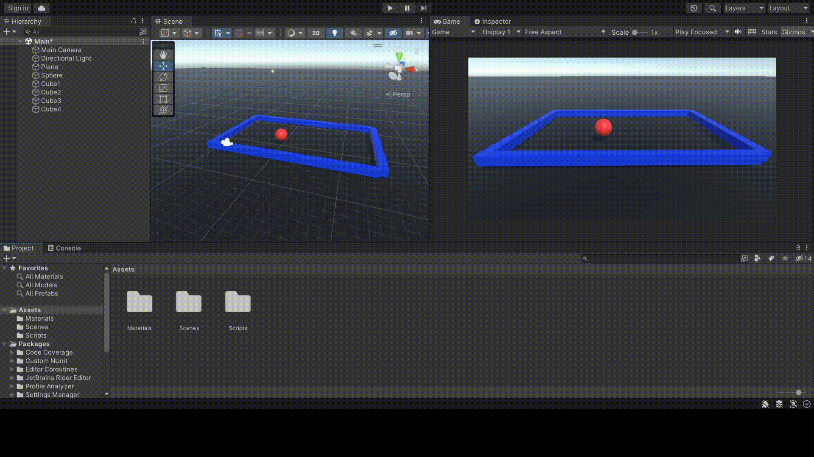

# Rigidbodies And Colliders
This is Lab 1 from the ACC VR Diploma by 412 Labs.

## Lab Requirements
- Create a cube, add a rigidbody and collider to it.
- Use Input System to make cube move on a plane.
- Cube should Debug.Log messages on collison.
    - BONUS: Cube should change material color on collison.

## Technologies Used

The task was developed using the following technologies:
    C#
    Unity Hub 3.4.1
    Visual Studio 2022 (as code editor)

## Running the Task

To run the project, 
- Open Unity Hub
    - Assets 
    - Scenes
    - Main.unity
- This will load the main scene for the project where you can interact with the rigid bodies and colliders.

## Demo

## Submission

This Lab was developed by 412 Labs and funded by the US Embassy.

## License

This project is licensed under the MIT License. Please see the LICENSE file for more information.